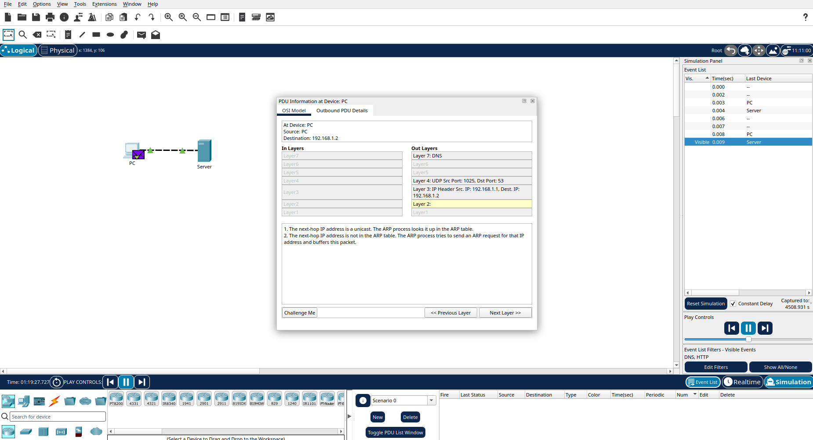
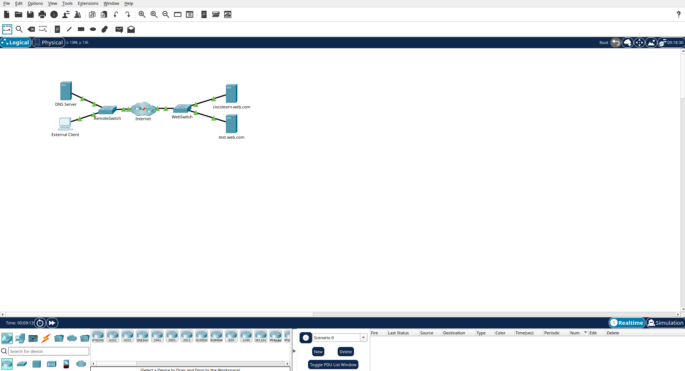
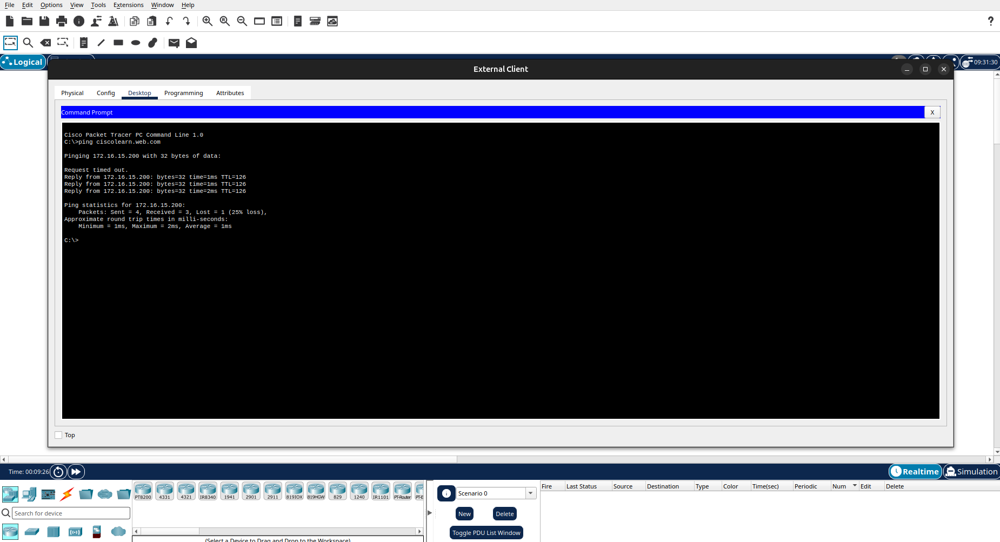
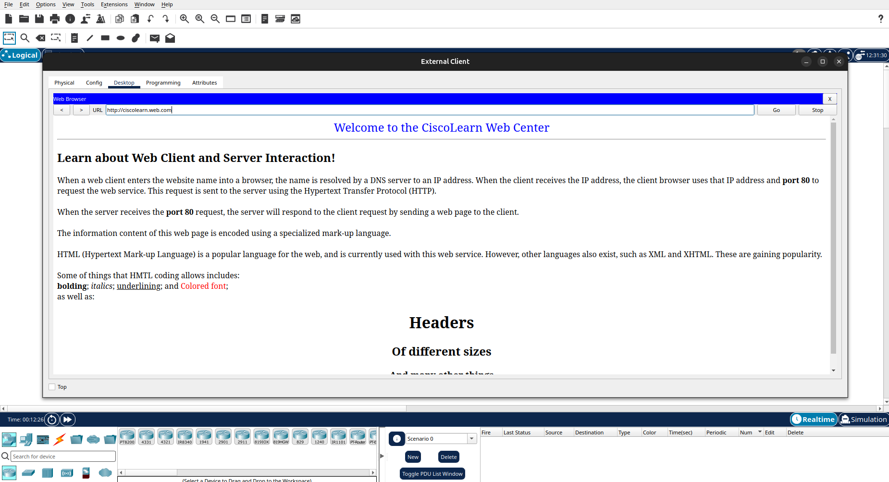
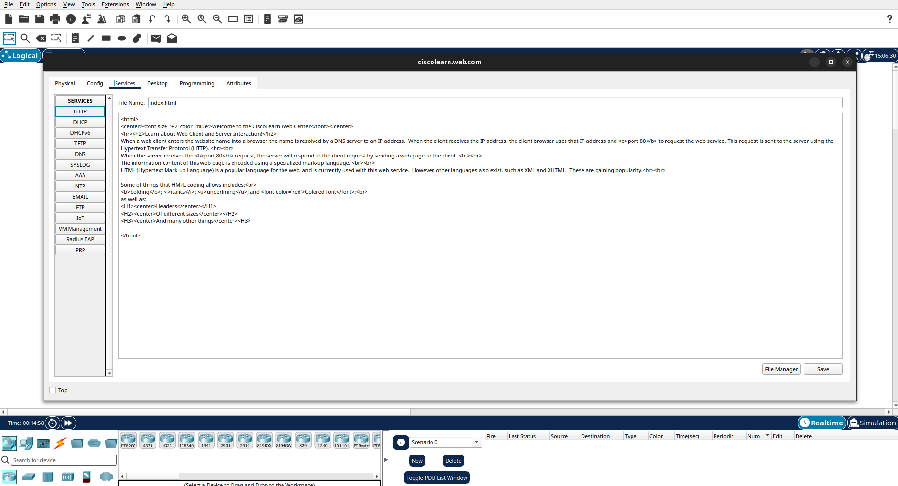
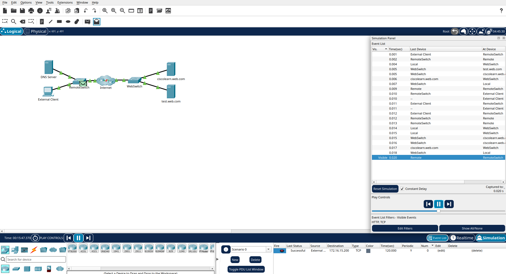
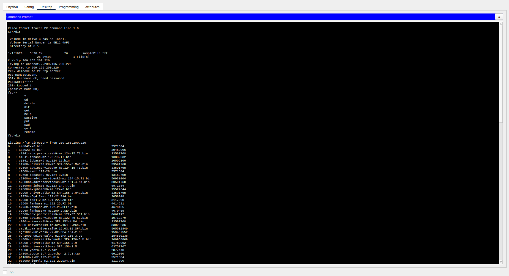
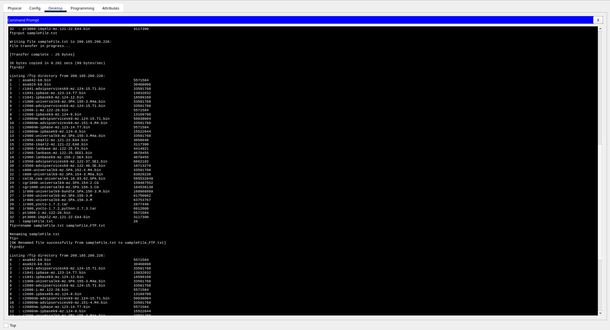
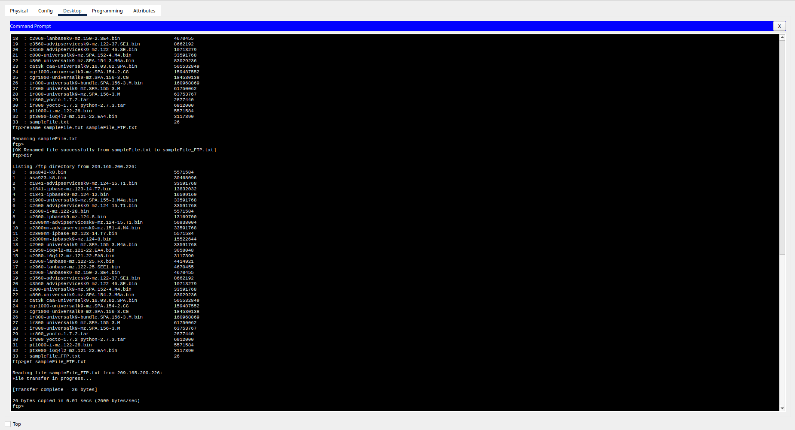
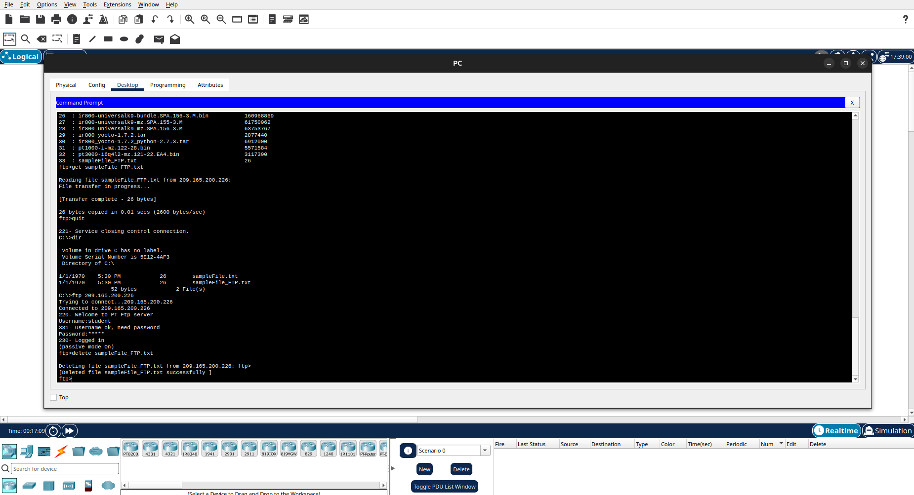

# Day 16 - Application Layer Services

## Day 16

Today I learned about **network application services, client-server communication, common application protocols, and URI/URL/URN**. I also performed several **Cisco Packet Tracer activities** to apply the concepts practically.

---

## 1. FTP Clients and Servers

**FTP (File Transfer Protocol)** provides a method for transferring files between computers over a network.

### FTP Client
An FTP client is software running on a host that connects to an FTP server and allows the user to perform file operations such as:

- Upload files
- Download files
- Rename files
- Delete files
- Manage files remotely

### FTP Server
An FTP server provides the FTP service and allows clients to exchange files with it.

### FTP Ports

FTP traditionally uses two TCP ports:

| Port | Purpose |
|---|---|
| TCP 21 | Control connection |
| TCP 20 | Data transfer |

The client initially connects to the FTP server using **TCP port 21** for control and commands. The traditional FTP data connection uses **TCP port 20**.

FTP clients can be command-line based or GUI-based. Modern operating systems such as Windows, Linux, and macOS can use FTP client software.

---

## 2. Web Clients and Servers

A **web client** is usually a web browser such as Chrome or Firefox.

A **web server** provides web pages and other web resources to clients.

### HTTP

**HTTP (Hypertext Transfer Protocol)** is used for communication between web clients and web servers.

- HTTP commonly uses **TCP port 80**
- HTTP is not encrypted
- Data transmitted using HTTP can potentially be intercepted

### HTTPS

**HTTPS (HTTP Secure)** provides secure communication between the browser and web server.

- HTTPS commonly uses **TCP port 443**
- It protects communication using encryption
- Websites using HTTPS begin with `https://`

### HTML

Web pages are commonly written using **HTML (HyperText Markup Language)**.

HTML tells the browser how to structure and display content such as:

- Text
- Images
- Fonts
- Links
- Page elements

### Basic Web Communication

```text
Web Browser (Client)
        |
        | HTTP/HTTPS Request
        ↓
Web Server
        |
        | HTTP/HTTPS Response
        ↓
Web Browser
```

---

## 3. Domain Name System (DNS)

**DNS (Domain Name System)** translates human-readable domain names into IP addresses.

For example:

```text
www.example.com
       ↓
    DNS lookup
       ↓
IP address
```

Humans find domain names easier to remember than IP addresses.

### How DNS Works

1. A host needs the IP address of a server.
2. The host sends a DNS request to a DNS server.
3. The DNS server checks its records.
4. If the IP address is found, it sends the address back.
5. If the local DNS server does not have the answer, it can query another DNS server.
6. The host can then use the returned IP address to communicate with the destination server.

### Common Top-Level Domains

- `.com`
- `.edu`
- `.net`

---

## 4. Network Application Services

Many everyday Internet services depend on protocols from the **TCP/IP protocol suite**.

Examples include:

- Internet browsing
- Social media
- Video streaming
- Audio streaming
- Online shopping
- Email
- Messaging
- File transfers

### Common Network Application Protocols

| Service | Protocol |
|---|---|
| Domain name resolution | DNS |
| Secure remote access | SSH |
| Email sending | SMTP |
| Email retrieval | POP |
| Email retrieval and synchronization | IMAP |
| Automatic IP configuration | DHCP |
| Web communication | HTTP |
| Secure web communication | HTTPS |
| File transfer | FTP |

Each protocol defines rules that allow different devices and software to communicate with each other.

---

## 5. Client-Server Relationship

A **server** is a host running software that provides information or services to other hosts on a network.

A **client** is a host or application that requests a service from a server.

### Basic Client-Server Model

```text
Client
  |
  | Request
  ↓
Server
  |
  | Response
  ↓
Client
```

### Example: Web Browsing

When a user opens a website:

```text
Browser
   ↓
DNS lookup
   ↓
IP address obtained
   ↓
HTTP/HTTPS request
   ↓
Web Server
   ↓
HTTP/HTTPS response
   ↓
Web page displayed in browser
```

A single computer can run multiple client applications and can also provide server services.

The client-server model works because devices and applications follow **standardized protocols and communication rules**.

---

## 6. URI, URL and URN

### URI

**URI (Uniform Resource Identifier)** is a string of characters used to identify a resource.

A URI can contain components such as:

- Scheme / protocol
- Hostname
- Path
- File name
- Fragment

Example:

```text
https://example.com/docs/page.html#section1
```

### URL

**URL (Uniform Resource Locator)** identifies the location of a resource and provides a way to access it.

Examples:

```text
https://example.com
ftp://example.com/file.txt
```

URLs can use different protocols such as:

- HTTP
- HTTPS
- FTP
- SFTP
- SSH

### URN

**URN (Uniform Resource Name)** identifies a resource by its name or namespace rather than specifying its network location.

### URI Relationship

```text
URI
├── URL
└── URN
```

A URL is a type of URI, while a URN is another type of URI.

---

## 7. Important Ports Learned

| Protocol / Service | Port | Transport |
|---|---:|---|
| FTP Control | 21 | TCP |
| FTP Data | 20 | TCP |
| HTTP | 80 | TCP |
| HTTPS | 443 | TCP |

---

## 8. Packet Tracer Activities

Today I also performed several **Cisco Packet Tracer activities** related to the concepts learned.

The activities helped me understand how:

- Clients communicate with servers
- Network services are configured
- Application protocols work over a network
- Port numbers are used for different services
- Web and FTP services can be accessed by clients
- IP addressing connects devices to network services












The practical activities helped connect the theoretical concepts with actual network communication.

---

## Key Learnings

- FTP is used to transfer files between clients and servers.
- FTP traditionally uses TCP port **21 for control** and TCP port **20 for data**.
- HTTP commonly uses TCP port **80**.
- HTTPS commonly uses TCP port **443** and provides encrypted communication.
- DNS translates domain names into IP addresses.
- Network applications depend on standardized protocols.
- A client sends a request and a server provides a response.
- Web browsers are common examples of clients.
- Web servers provide web resources to clients.
- URI identifies a resource, while URL identifies its location and access method.
- URN identifies a resource by its name or namespace.
- Packet Tracer is useful for understanding and practicing real network communication.

---

## Day 16 Summary

The main concept I learned today is:

> **Network applications communicate between clients and servers using standardized protocols, IP addresses, and port numbers.**

Today's learning helped me connect DNS, IP addresses, ports, protocols, clients, and servers into one complete picture of how network services work.

---
