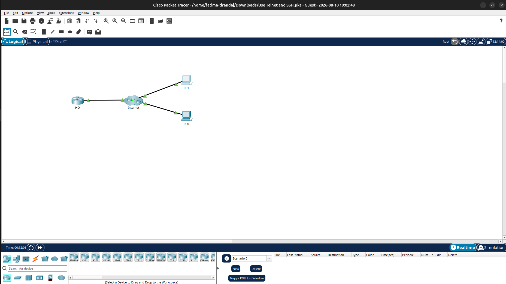
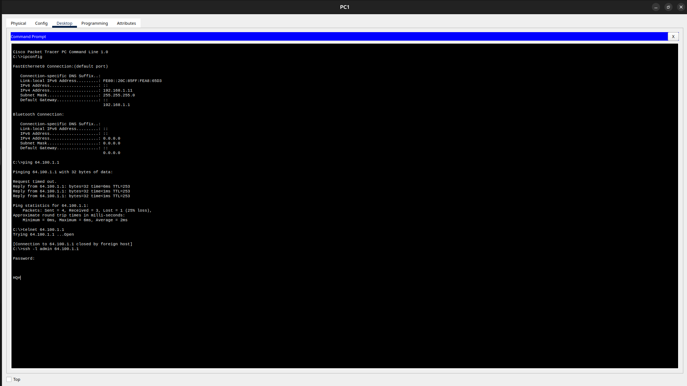

# Day 17 - Application Layer Services -2 


## Topics Learned

### 1. Virtual Terminals: Telnet and SSH

#### Telnet

Telnet is a protocol used to remotely access the command-line interface (CLI) of another device over a network.

- Uses **TCP port 23**
- Provides a virtual terminal session
- Allows remote administration of network devices
- Sends data as **plaintext**
- Login credentials and commands can potentially be intercepted
- Therefore, Telnet is **not considered secure**

Example:

```text
PC → Telnet → Router/Switch
```

#### SSH (Secure Shell)

SSH provides secure remote access to network devices.

- Uses **TCP port 22**
- Encrypts the communication
- Provides stronger authentication
- Protects session data from being easily intercepted
- Preferred over Telnet for network administration

Example:

```text
PC → SSH → Router/Switch
```

### Telnet vs SSH

| Feature | Telnet | SSH |
|---|---|---|
| Port | 23 | 22 |
| Encryption | No | Yes |
| Security | Low | High |
| Remote CLI | Yes | Yes |
| Recommended | No | Yes |

**Key learning:** Network administrators should use SSH instead of Telnet whenever possible.

---

## 2. Email and Messaging

Email communication uses different application-layer protocols depending on whether messages are being sent or received.

### SMTP — Simple Mail Transfer Protocol

SMTP is used for **sending email**.

- Commonly uses **TCP port 25**
- Used between an email client and mail server
- Also used between mail servers when transferring messages

Basic flow:

```text
Email Client → SMTP → Mail Server
```

### POP3 — Post Office Protocol Version 3

POP3 is used to retrieve email from a mail server.

- Uses **TCP port 110**
- Traditionally downloads messages to the client
- By default, messages may be removed from the server after being accessed

```text
Mail Server → POP3 → Email Client
```

### IMAP4 — Internet Message Access Protocol Version 4

IMAP is also used to access email stored on a mail server.

- Uses **TCP port 143**
- Keeps messages stored on the server
- Allows users to access and manage the same mailbox from multiple devices
- Messages remain on the server unless deleted

### POP3 vs IMAP

| Feature | POP3 | IMAP |
|---|---|---|
| Port | 110 | 143 |
| Messages stored on server | Usually not after download | Yes |
| Multiple-device access | Limited | Better |
| Main purpose | Download email | Synchronize/access email |

---

## 3. Text Messaging

Text messaging allows users to communicate in real time over a network.

It may also be called:

- Instant messaging
- Direct messaging
- Private messaging
- Chat messaging

Many computer-based messaging services are accessed through web-based clients integrated into social media or information-sharing platforms.

---

## 4. VoIP

**VoIP (Voice over Internet Protocol)** allows voice communication to take place over an IP network.

Instead of sending voice as traditional analog telephone signals, VoIP:

1. Converts voice into digital data.
2. Encapsulates the data into IP packets.
3. Sends the packets through the network.
4. Reconstructs the voice at the destination.

```text
Voice
  ↓
Digital Data
  ↓
IP Packets
  ↓
Network
  ↓
Receiver
```

**Key learning:** VoIP makes it possible to carry phone conversations over IP networks.

---

# 🖥️ Packet Tracer Activity

I also performed a Packet Tracer activity involving remote access using **Telnet and SSH**.

### Activity topology

The activity included:

```text
PC1
     Internet ─── HQ Router
  /
PC0
```

The activity demonstrated how a PC can communicate with a remote network device and access its CLI remotely.




### Commands and tests performed

#### 1. Checking network configuration

Used:

```text
ipconfig
```

This displayed information such as:

- IPv4 address
- Subnet mask
- Default gateway
- IPv6 information

#### 2. Testing connectivity

Used:

```text
ping 64.100.1.1
```

The ping test successfully received replies, although one request timed out.

Result:

```text
Packets: Sent = 4, Received = 3, Lost = 1 (25% loss)
```

This demonstrated that the destination was reachable, while also showing that packet loss can occur during communication.

#### 3. Testing Telnet

Used:

```text
telnet 64.100.1.1
```

The connection attempt demonstrated remote terminal access through Telnet.

#### 4. Connecting using SSH

Used:

```text
ssh -l admin 64.100.1.1
```

After entering the password, remote CLI access to the HQ device was established.

This demonstrated the difference between unsecured Telnet access and encrypted SSH access.

---

# Final Course Assessment

After completing the learning modules and Packet Tracer activities, I took the **Cisco Networking Basics final exam**.

### Result

The assessment showed the following performance areas:

| Skill | Score |
|---|---:|
| Configure a wireless router and wireless host to connect to the internet in a home network | 100% |
| Explain how protocols, devices, and media enable communication on networks | 100% |
| Explain how IP addresses enable network communication | 89.5% |
| Create a simple LAN | 89.5% |
| Use application layer services to accomplish real-world tasks | 76.5% |

---

# Key Learnings

- Telnet allows remote CLI access but sends information in plaintext.
- SSH provides secure and encrypted remote access.
- **Telnet → TCP 23**
- **SSH → TCP 22**
- SMTP is mainly used for sending email.
- **SMTP → TCP 25**
- POP3 is used to retrieve/download email.
- **POP3 → TCP 110**
- IMAP keeps email synchronized on the mail server.
- **IMAP4 → TCP 143**
- VoIP allows voice communication over IP networks.
- Packet Tracer helped demonstrate real remote-access concepts.
- `ping` can be used to test network connectivity.
- `ipconfig` can be used to view a host's IP configuration.
- Application-layer protocols provide services that users interact with directly.

---

# Overall Learning Reflection

Day 17 marked the **completion of my Cisco Networking Basics course**.

Over the course, I progressed from understanding basic networking concepts to working with IP addressing, network devices, protocols, LANs, Packet Tracer simulations, application-layer services, and remote-access technologies.

The most useful practical part was working with **Cisco Packet Tracer**, because it helped connect the theoretical concepts with actual network communication.

Finishing the course with a **92% final exam score** was a strong conclusion to the learning journey.


